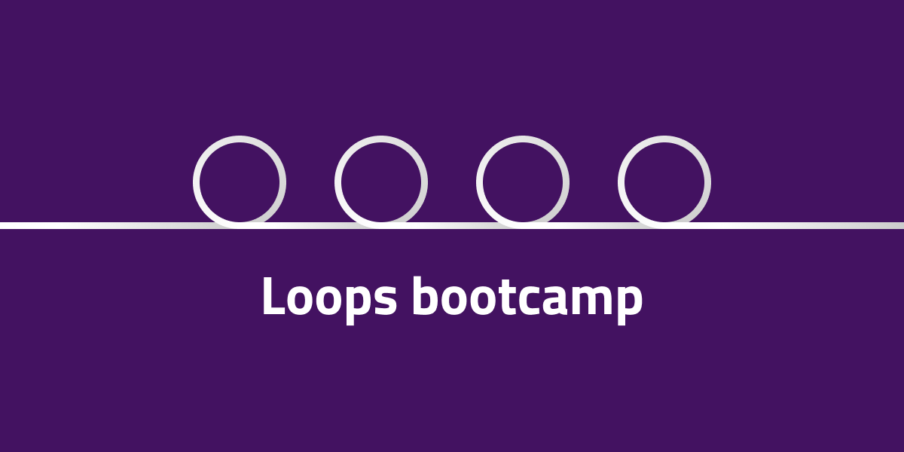

# Loops Bootcamp
**En med hög övningar för att träna på loopar.**

## Classic For loops

1. Skapa en loop som itererar 1000 varv. För varje iteration ska du ```console.log()``` vilket varv du är på.

2. Skapa en loop som räknar ner från 100 till 0. För varje varv ska du ```console.log()``` vilket varv du är på.

```javascript
let fruits = ['apple', 'orange', 'pear', 'kiwi', 'pineapple'];
```

3. Loopa ut ovanstående array med en for-loop. För varje varv ska du ```console.log()``` innehållet ( frukten ).

4. Loopa ut ovanstående array med ```console.log()```. Sätt vilket index varje frukt har framför. Ex. ```0. apple, 1. orange``` osv.

## For of loops

```js 
let things = ['hammer', 'nails', 'ruler', 'screwdriver', 'screws', 'saw'];
```

6. Loopa ut ovanstående array och ```console.log()``` varje pryl.


## For Each loops

```js 
let things = ['hammer', 'nails', 'ruler', 'screwdriver', 'screws', 'saw'];
```

7. Loopa ut ovanstående array och ```console.log()``` varje pryl.

8. Loopa ut ovanstående array och ```console.log()``` varje pryl samt vilken position i arrayen den har.


## While loops

9. Skapa en while-loop som kör 1000 varv. ```console.log()``` ut varje varv.


## Loop da loops

10. Generera en *kortlek* med 52 kort där varje kort innehåller en färg ( suite ) och ett värde mellan 2 och 14 ( ess ). Ex.

```javascript
[..., 'hjärter 8', 'hjärter 9', ...]
```


11. Loopa ut samtliga vänners favoritfrukter med en ```console.log()```.

```js
let friends = [
    {
        name: 'Sixten',
        likes: [
            'bananas',
            'strawberries',
            'blueberries'
        ]
    },
    {
        name: 'Khalid',
        likes: [
            'papaya',
            'pear',
            'pineapple'
        ]
    },
    {
        name: 'Lisa',
        likes: [
            'raspberries',
            'watermelon',
            'apple'
        ]
    }
]

```